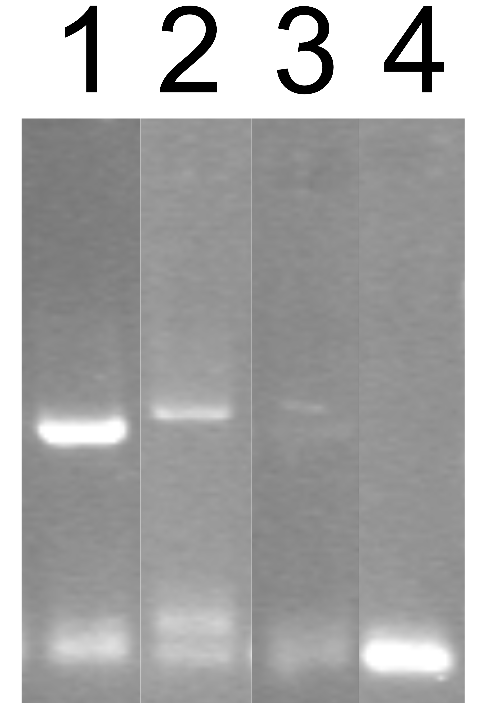
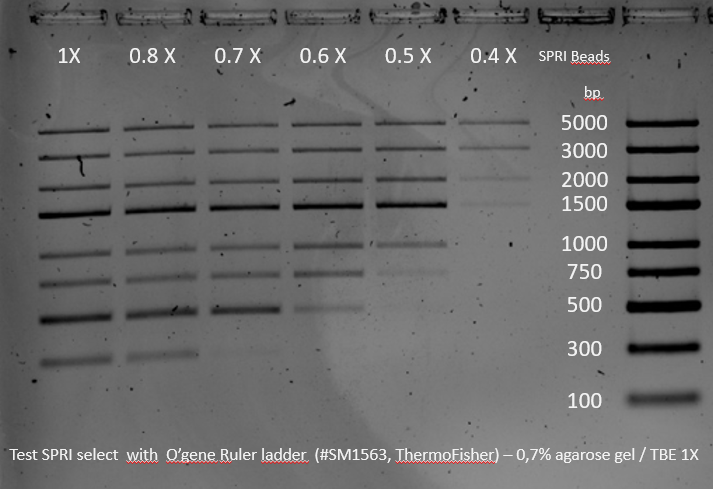

```{r, echo=FALSE, results='hide',message=FALSE}
library(plotly)
library(DT)
library(htmltools)
library(reactable)
library(bslib)
library(thematic)
```

# Sampling

## Row 1 {data-height="100," data-padding="15"}

### eDNA sampling

For the sampling protocol we use the eDNA sampling kit from <a href="https://sylphium.com/eng/">Sylphium</a> as well as a <a href="https://www.amazon.com.be/FIRSTINFO-Pressure-Patented-Extractor-Thinnest/dp/B01EN57AOG/ref=pd_rhf_se_s_ci_mcx_mr_hp_d_d_sccl_1_6/259-6443971-9025643?pd_rd_w=MxJk1&content-id=amzn1.sym.317fe9bc-40a2-4f67-9e00-2333850193dd:amzn1.symc.1b44a113-f80b-4bad-946d-45e84e3d8ccf&pf_rd_p=317fe9bc-40a2-4f67-9e00-2333850193dd&pf_rd_r=94VM0MEDW2GZ011H7ZBH&pd_rd_wg=Z1oH5&pd_rd_r=cd129295-10d9-4b4f-a9e9-869e5034260c&pd_rd_i=B01EN57AOG&psc=1">car oil vacuum pump extraction</a>

## Row 2 {data-height="450" data-padding="15"}

### Sampling protocol

```{r, echo=FALSE}
knitr::include_url("https://www.youtube.com/embed/mu5TBGr1psM")
```

### Vacuum pump


## Row 3 {data-height="200," data-padding="15"}

### More info about the pump.

The pump is an oil vacuum pump that is initially used to extract oil from cars. It is simply composed of a tank in which you can manually create a vacuum using the manual pump. The pump is composed of a **safety valve (1)** as well as a **pressure gauge (2)**. The safety valve will allow the air to flow in when the pressure is too high and to avoid the pump to collapse on itself. However, since the pump is build to extract hot oil (that weaken the strength of the tank's wall) and not cold water, this is unlikely to happen and so, the safety valve can be blocked using paraffin allowing the building of a higher pressure. The pressure gauge is usefull to keep track of the pressure inside the tank and have a view of how clogged is the filter.

# eDNA extraction

## Row 1 {data-height="100," data-padding="15"}

### Sylphium

The protocol used for eDNA extraction is the deticated protocol from <a href="https://sylphium.com/eng/">Sylphium</a>, accesible <a href="https://drive.google.com/file/d/1fcXxarkHHFZy_1qAkXndvTMQxwztIvZf/view?pli=1">here</a>

## Row 1 {data-height="600," data-padding="15"}

### eDNA extraction protocol

<embed src="Media/eDNA_protocol.pdf" type="application/pdf" width="100%" height="600px">

### Tips

Some minor modifications have been made to the main protocol, primarily to concentrate the sample:

-   The eDNA pellet is diluted in 10 µl instead of 100 µl.

-   Multiple extractions can be performed from a single filter. Typically, 3 ml of conservation buffer can be extracted from the filter, allowing for three extractions. To further concentrate the sample, the 10 µl of eluate from the first extraction is used for the second extraction, followed by the third. This process concentrates the DNA obtained from the 3 ml of extraction buffer into a single 10 µl of eluate.

# PCR {data-navmenu="eDNA sequencing"}

## Row 1 {data-height="100," data-padding="15"}

### Introduction

For eDNA sequence production, we use a 2-step PCR amplification protocol as well as Nanopore sequencing.

## Row 2 {data-height="600," data-padding="15"}

### 2-Step PCR

the 2-Step PCR protocol is a PCR amplification that can be use for both metabarcoding and barcoding. The advantages of using this method is the ability to avoid the use of the Nanopore Native barcoding kit that use expensive ligase in order the barcode sequences. This protocol is therefore much cheaper than using the barcoding kit as well as being much faster.

The PCR protocol is a drop in the lid protocol. barcodes primers are firstly dried in the lid before loading the master mix and the sample. This allow to input later the barcodes in the master mix (to avoid interaction between the inner primers and the outter primer) without the need ot open the tube. The input of the barcode primers are simplu done by mixing the tube in the middle of the PCR cycles. Mixing will add the barcode primers that were previously dried on the lid of the PCR tube.

### 2-Step PCR protocol

<embed src="Media/2-step PCR protocol_JF2.pdf" type="application/pdf" width="100%" height="600px">

# PCR cleanup {data-navmenu="eDNA sequencing"}

## Row 1 {data-height="100,\"" data-padding="15"}

### Introduction

Flowing the PCR amplification, each PCR sample can be pooled into one single tube as each sample are now differently barcoded. However it is important to adjust approximately the concentration of each sample using the strength of the gel band observed on the agarose gel. Each sample should have more less the same concentration in the pool.

## Row 1 {data-height="30,\"" data-padding="15"}

### 

::: {style="display: flex; justify-content: center; align-items: center; height: 100%; width: 100%;"}
**PCR pool**
:::

## Row 1 {data-height="300,\"" data-padding="15"}

### Band strength



### Note

By experience the following ratio can be done:

1.  Strong band : 1 µl

2.  Mildly band : 2 µl

3.  Faint band (but still visible) : 4 µl

4.  No band : 6 µl

## Row 1 {data-height="30,\"" data-padding="15"}

### 

::: {style="display: flex; justify-content: center; align-items: center; height: 100%; width: 100%;"}
**Cleanup**
:::

## Row 1 {data-height="600," data-padding="15"}

### Cleanup protocol

<embed src="Media/Beads_cleanup.pdf" type="application/pdf" width="100%" height="600px">

### Size selection overview of SPRI beads



### Note

SPRI beads are magnetic beads that perform a sequence size selection based on the volume ratio beads/sample.

Since we want to remove primers dimers (around 150 bp), the optimal beads ratio for the protocol is 0.65. However if you want to remove bigger sequence size to remove non-specific amplification, you are free to use different ratio.

# Sequencing {data-navmenu="eDNA sequencing"}

## Row 3 {data-height="100," data-padding="15"}

### Introduction

For the sequencing we use the <a href="https://nanoporetech.com/document/ligation-sequencing-amplicons-sqk-lsk114?device=PromethION">SQK-LSK114 protocol</a> on Promtehion flow cell. 

## Row 3 {data-height="600," data-padding="15"}

### SKQ-LSK114 Promethion sequncing protocol

<embed src="Media/ligation-sequencing-amplicons-sqk-lsk114-document-checklist-PromethION-en-ACDE_9163_v114_revW_30Jan2025-35.pdf" type="application/pdf" width="100%" height="600px">

### Note 


