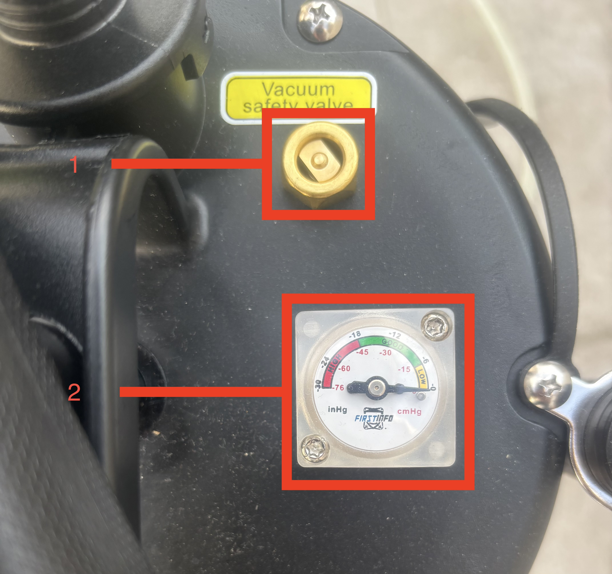

```{r, echo=FALSE, results='hide',message=FALSE}
library(plotly)
library(DT)
library(htmltools)
library(reactable)
library(bslib)
library(thematic)
```
## Row 1 {data-height="100," data-padding="15"}

### eDNA sampling 

For the sampling protocol we use the eDNA sampling kit from <a href="https://sylphium.com/eng/">Sylphium</a> as well as a <a href="https://www.amazon.com.be/FIRSTINFO-Pressure-Patented-Extractor-Thinnest/dp/B01EN57AOG/ref=pd_rhf_se_s_ci_mcx_mr_hp_d_d_sccl_1_6/259-6443971-9025643?pd_rd_w=MxJk1&content-id=amzn1.sym.317fe9bc-40a2-4f67-9e00-2333850193dd:amzn1.symc.1b44a113-f80b-4bad-946d-45e84e3d8ccf&pf_rd_p=317fe9bc-40a2-4f67-9e00-2333850193dd&pf_rd_r=94VM0MEDW2GZ011H7ZBH&pd_rd_wg=Z1oH5&pd_rd_r=cd129295-10d9-4b4f-a9e9-869e5034260c&pd_rd_i=B01EN57AOG&psc=1">car oil vacuum pump extraction</a>


## Row 2 {data-height="450" data-padding="15"}

### Sampling protocol
```{r, echo=FALSE}
knitr::include_url("https://www.youtube.com/embed/mu5TBGr1psM")
```

### Vacuum pump



## Row 3 {data-height="200," data-padding="15"}

### More info about the pump. 

The pump is an oil vacuum pump that is initially used to extract oil from cars. It is simply composed of a tank in which you can manually create a vacuum 
using the manual pump. The pump is composed of a safety valve (1) as well as a pressure gauge (2). The safety valve will allow the air to flow in when the pressure is too high and to avoid the pump to collapse on itself. However, since the pump is build to extract hot oil (that weaken the strength of the tank's wall) and not cold water, this is unlikely to happen and so, the safety valve can be blocked using paraffin allowing the building of a higher pressure. The pressure gauge is usefull to keep track of the pressure inside the tank and have a view of how clogged is the filter. 


```{r}

```
