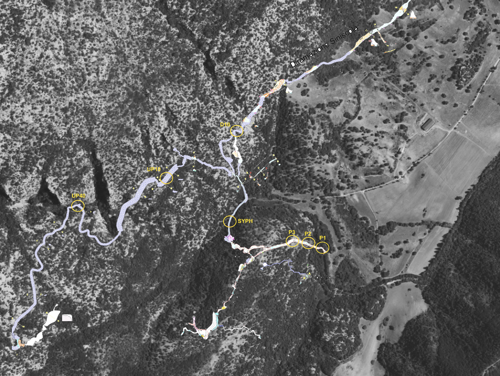

```{r, echo=FALSE, results='hide',message=FALSE}
library(plotly)
library(DT)
library(htmltools)
library(reactable)
library(bslib)
library(thematic)
library(knitr)
```

SEPT_2024 {data-navmenu="Locoli"}
=====================================

Column {.sidebar}
-----------------------------------------------------------------------

<button onclick="showGraph('graph1')">28S</button>
<button onclick="showGraph('graph2')">CO1</button>


## Row 1 {data-height=700, data-padding=15}

### Map

```{r, echo=FALSE,message=FALSE, fig.align='center'}

```

### Note

Detected species has been calculated by removing every OTU that had less than 90 query coverage and less than 99% pident. The pident treshold has been chosen following Egeter et al. 2022. The coverage treshold has been chosen arbitrarly

## Row 4 {data-height=5, data-padding=15}

### <span style="font-size: 24px;">CO1</span>

## Row 2 {data-width=800, data-padding=15}

### NMDS 

```{r, echo=FALSE, results='hide',message=FALSE, fig.align='center'}
thematic::thematic_rmd(font = "auto")
load("SARD/SEPT24/CO1/NMDS.RData")
load("SARD/SEPT24/28S/NMDS.RData")

# Render each plot as HTML
graph1_html <- knit_print(a)
graph2_html <- knit_print(NMDS_28S)

# Combine into div containers with proper styles
div1 <- div(id = "graph1", style = "display: block;", HTML(as.character(graph1_html)))
div2 <- div(id = "graph2", style = "display: none;", HTML(as.character(graph2_html)))

# Display or combine for rendering
browsable(tagList(div1, div2))
```

<script>
  function showGraph(graphId) {
    // Hide all graphs
    document.getElementById('graph1').style.display = 'none';
    document.getElementById('graph2').style.display = 'none';

    // Show the selected graph
    document.getElementById(graphId).style.display = 'block';
  }
</script>

### Krona

Note that this Krona plot has been made withe the best blast identity possible. Some of the OTUs did not have good blast using NCBI database. For species presence absence refers to the "Detected species" tab
<br>

::: {style="background-color: grey; padding: 20px;"}
```{r, echo=FALSE, results='asis'}
thematic::thematic_rmd(font = "auto")
htmltools::tags$iframe(
  src = "SARD/SEPT24/CO1/krona_plot.html",
  width = "100%",
  height = "700px",
  frameborder = "0"
)
```
:::

## Row 3 {data-height=700, data-width=600}

### Detected Species

```{r, echo=FALSE}
thematic::thematic_rmd(font = "auto")
load("SARD/SEPT24/CO1/DETECT_SPECIES.RDATA")
datatable(DETECT_SPECIES, options = list(
  pageLength = 10,   # Set the number of rows visible initially
  scrollY = 500,     # Enable vertical scrolling with a fixed height
  scrollX = TRUE# Enable horizontal scrolling for wide tables
), width = "10%")
```

## Row 4 {data-height=5, data-padding=15}

### <span style="font-size: 24px;">28S</span>

## Row 4 {data-height=700, data-padding=15}

### NMDS 

### Krona

::: {style="background-color: grey; padding: 20px;"}
```{r, echo=FALSE, results='asis'}
thematic::thematic_rmd(font = "auto")
htmltools::tags$iframe(
  src = "SARD/SEPT24/28S/krona_plot.html",
  width = "100%",
  height = "700px",
  frameborder = "0"
)
```
:::

## Row 4 {data-height=700, data-padding=15}

### Detected Species

```{r, echo=FALSE}
thematic::thematic_rmd(font = "auto")
load("SARD/SEPT24/28S/DETECT_SPECIES.RDATA")
datatable(DETECT_SPECIES, options = list(
  pageLength = 10,   # Set the number of rows visible initially
  scrollY = 500,     # Enable vertical scrolling with a fixed height
  scrollX = TRUE# Enable horizontal scrolling for wide tables
), width = "10%")
```

JUL_2024 {data-navmenu="Aqueduct"}
=====================================

## Row 3 {data-height=500, data-padding=15}

### Detected species


```{r, echo=FALSE}
load("SARD_AQ/JUL/CO1/DETECT_SPECIES.RDATA")
datatable(DETECT_SPECIES)
```

